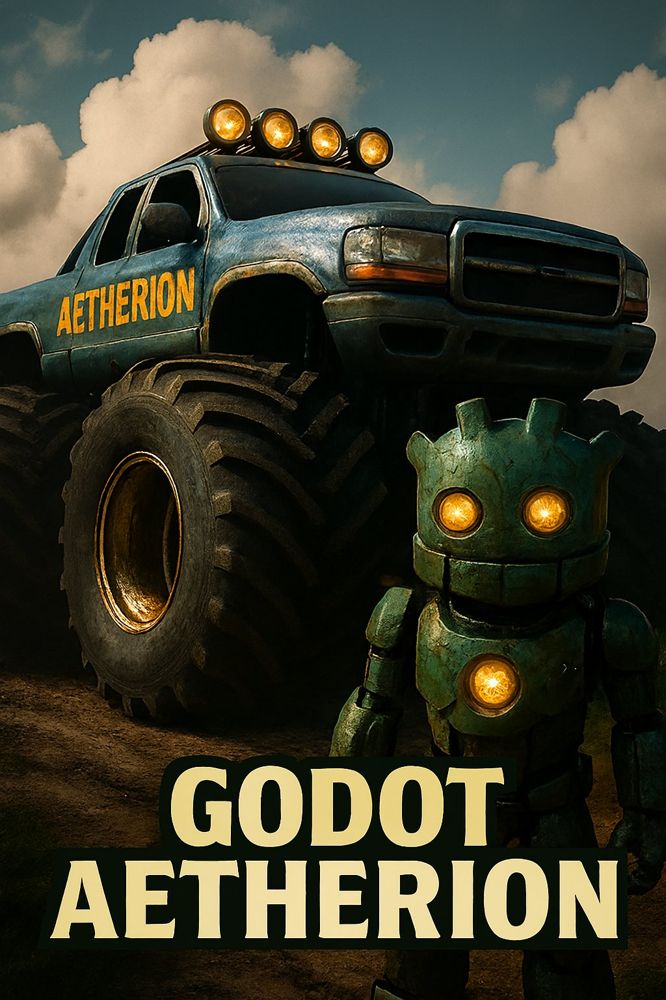

<p align="center">
  
</p>


# zv9.Aetherion 
2D/3D procedural gen core rust gdextension. 

```text
╔═══════════════════════════════════════════════════════════════════════════╗
║ 🌌 AETHERION GRAPHICS PROCESSOR — zv9.aetherion                         	║
║                                                                           ║
║ Yo. This is Aetherion. It’s the procedural brainstem of Godot,            ║
║ written in Rust, and it shreds in both 2D and 3D. Modular, signal-driven  ║
║ and introspectable like a corvette.                                       ║
║                                                                           ║
║ > “Every tile’s a glyph. Every signal’s a chant. Aetherion listens.”      ║
║                                                                          	║
╠═══════════════════════════════════════════════════════════════════════════╣
║ ✨ FEATURES                                                              	║
║                                                                          	║
║ • Dimension-agnostic: 2D/3D? Doesn’t matter. It flows.                  	║
║ • Modular: Each subsystem’s a ritual. Swap, remix, teach.              	║
║ • Signal-based: Godot signals, but like, sacred geometry.              	║
║ • Rust-powered: Fast, safe, and metal.                                 	║
║ • Debug overlays: See the echoes. Ride the wave.                       	║
║                                                                          	║
╠═══════════════════════════════════════════════════════════════════════════╣
║ 🧱 INSTALLATION                                                          	║
║                                                                           ║
║ 1. Clone it:                                                            	║
║    git clone https://github.com/zv9/aetherionengine.git                	║
║                                                                          	║
║ 2. Build it:                                                            	║
║    cargo build --release                                               	║
║                                                                          	║
║ 3. Link the .so/.dll/.dylib in Godot.                                  	║
║                                                                          	║
║ 4. Add AetherionEngine node or autoload.                               	║
║                                                                          	║
╠═══════════════════════════════════════════════════════════════════════════╣
║ 📦 MODULES                                                         	    ║
║                                                                           ║
║c:/zv9/zv9.aetherion/rust/src/                                             ║
║                                                                           ║
║src/                                                                       ║
║zv9_aetherion_codegen_config.rs         // DSL config schema               ║
║zv9_aetherion_codegen_dsl.rs            // DSL token + parser stub         ║
║zv9_aetherion_codegen_emitter.rs        // DSL → Rust emitter              ║
║zv9_aetherion_codegen_parser.rs         // DSL parser logic                ║
║zv9_aetherion_core_conductor.rs         // Tick-based command queue        ║
║zv9_aetherion_core_dimension.rs         // World dimension logic           ║
║zv9_aetherion_core_lifecycle.rs         // Engine lifecycle hooks          ║
║zv9_aetherion_core_runtime.rs           // Runtime entry + orchestration   ║
║zv9_aetherion_generator_noise.rs        // Noise generation core           ║
║zv9_aetherion_generator_noise_config.rs // Noise config presets            ║
║zv9_aetherion_generator_pattern_type.rs // Pattern type enum               ║
║zv9_aetherion_generator_patterns.rs     // Pattern generation logic        ║
║zv9_aetherion_interaction_modifiers.rs  // Runtime modifiers               ║
║zv9_aetherion_interaction_tools.rs      // Interaction tools               ║
║zv9_aetherion_pipeline_builder_builder.rs   // Map builder orchestration   ║
║zv9_aetherion_pipeline_builder_streamer.rs  // Chunk streaming logic       ║
║zv9_aetherion_pipeline_builder_threaded.rs  // Threaded pipeline support   ║
║zv9_aetherion_pipeline_data_chunk.rs        // Chunk data container        ║
║zv9_aetherion_pipeline_data_data.rs         // Raw map data                ║
║zv9_aetherion_pipeline_data_grid.rs         // Grid utilities              ║
║zv9_aetherion_pipeline_data_map_build_options.rs // Build options struct   ║
║zv9_aetherion_pipeline_data_options.rs      // Configurable pipeline options║
║zv9_aetherion_pipeline_data_tile.rs         // Tile-level data             ║
║zv9_aetherion_pipeline_data_vector.rs       // Vector math helpers         ║
║zv9_aetherion_structure_generation.rs       // Structure generation logic  ║
║zv9_aetherion_structure_placement.rs        // Structure placement rules   ║
║zv9_godot_interface_api_config.rs       // Config API                      ║
║zv9_godot_interface_api_engine.rs       // Engine API                      ║
║zv9_godot_interface_api_generator.rs    // Generator API                   ║
║zv9_godot_interface_api_map.rs          // Map API                         ║
║zv9_godot_interface_api_oracle.rs       // Oracle API                      ║
║zv9_godot_interface_api_signals.rs      // Signal API                      ║
║zv9_godot_interface_bindings_godot_types.rs // Godot type bindings         ║
║zv9_godot_interface_interface_controls.rs   // UI control panel            ║
║zv9_godot_interface_interface_diagnostics.rs // Diagnostics overlay        ║
║zv9_godot_interface_messaging_messages.rs   // Messaging structs           ║
║zv9_godot_interface_messaging_sync.rs       // Sync bridge                 ║
║zv9_godot_interface_signals_definitions.rs  // Signal definitions          ║
║zv9_godot_interface_signals_dispatch.rs     // Signal dispatch logic       ║
║zv9_shared_grid_bounds.rs              // Grid bounds struct               ║
║zv9_shared_grid2d.rs                   // 2D grid abstraction              ║
║zv9_shared_math.rs                     // Math helpers                     ║
║zv9_shared_spatial.rs                  // Spatial utilities                ║
║zv9_shared_traits.rs                   // Shared traits                    ║
║zv9_shared_types.rs                    // Common types                     ║
║zv9_trailkeeper_entry.rs              // Log entry struct                  ║
║zv9_trailkeeper_macros.rs             // Logging macros                    ║
║zv9_trailkeeper_registry.rs           // Component registry                ║
║zv9_util_config.rs                    // Config loader                     ║
║zv9_util_logging.rs                   // Logging backend                   ║
║zv9_util_time.rs                      // Time helpers                      ║
║zv9_util_profiling.rs                 // Profiling tools                   ║
║zv9_util_position.rs                  // Position helpers                  ║
║zv9_util_direction.rs                 // Directional math                  ║
║zv9_util_timer.rs                     // Timer abstraction                 ║
║zv9_util_velocity.rs                  // Velocity math                     ║
║zv9_api.rs                             // External API surface             ║
║zv9_lib.rs                             // Crate root                       ║
║zv9_prelude.rs                         // Shared imports                   ║
║zv9_bin_aetherion_binary.rs          // Dev console binary                 ║
║zv9_bin_sync_audit.rs                // Audit sync tool                    ║
║zv9_bin_sync_to_godot.rs             // Godot sync bridge                  ║
╠═══════════════════════════════════════════════════════════════════════════╣
║ 🛠 ROADMAP                                                              	║ 	
║                                                                          	║
║ ✓ Unified 2D/3D placement													║
║ ✓ Signal manifest + echo logger											║
║ ✓ Multi-threaded chunk streaming											║
║ ✓ Game-agnostic trait system												║
║ ☐ Terrain synthesis modules											 	║
║ ☐ Legacy docs system														║
║ ☐ Plugin-ready for Godot Asset Library									║
║ ☐ Save/load serialization layer											║
║ ☐ Procedural voxel support (3D tilemap)									║
║					                                 						║
║                                                                           ║
╠═══════════════════════════════════════════════════════════════════════════╣
║ 🧙 PHILOSOPHY                                                           	║
║                                                                          	║
║ Aetherion ain’t just code—it’s a ritual. Every module’s a        			║
║ copybox. Every signal’s a whisper from the grid. We build for legacy,  	║
║ clarity, and future skaters of the procedural cosmos.                  	║
║                                                                          	║
║ > “The cathedral is modular. The veil is thin. The echo persists.”     	║
║                                                                          	║
╠═══════════════════════════════════════════════════════════════════════════╣
║ 📜 LICENSE                                                              	║
║                                                                          	║
║ MIT — because rituals should be shared, and freedom is rad.            	║
║                                                                          	║
╠═══════════════════════════════════════════════════════════════════════════╣
║ 🌀 CREDITS                                                              	║
║                                                                          	║
║ Built by Greg. (zv9games)                                              	║
║ Inspired by Copilot, Grok, Godot, and the sacred geometry of open-source.	║
║ Special thanks to the Pacman2.0 project for revealing the need.			║
╚═══════════════════════════════════════════════════════════════════════════╝
