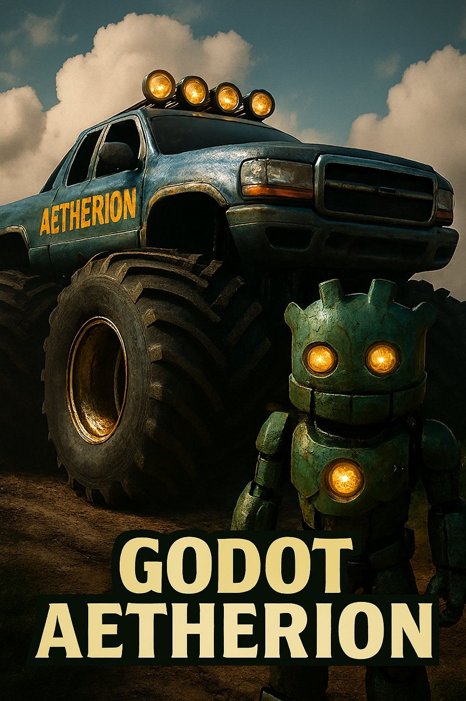

<p align="center">
  
</p>


# zv9.Aetherion (AETHERION SUPER MASSIVE EXPANSIVE ARC UPDATE 8.4)
2D/3D procedural gen core rust gdextension. 

```text
╔═══════════════════════════════════════════════════════════════════════════╗
║ 🌌 AETHERION GRAPHICS PROCESSOR — zv9.aetherion                         	║
║                                                                           ║
║ Yo. Pacman. Aetherion. Rust. There are code updates not listed here.      ║
║                                                                          	║
╠═══════════════════════════════════════════════════════════════════════════╣
║ ✨ FEATURES                                                              	║
║                                                                          	║
║ • Dimension-agnostic: 2D/3D? Doesn’t matter. It flows.                  	║
║ • Modular: Each subsystem’s a ritual. Swap, remix, teach.              	║
║ • Signal-based: Godot signals, but like, sacred geometry.              	║
║ • Rust-powered: Fast, safe, and metal.                                 	║
║ • Debug overlays: See the echoes. Ride the wave.                       	║
║                                                                          	║
╠═══════════════════════════════════════════════════════════════════════════╣
║ 🧱 INSTALLATION                                                          	║
║                                                                           ║
║ 1. Clone it:                                                            	║
║    git clone https://github.com/zv9/aetherionengine.git                	║
║                                                                          	║
║ 2. Build it:                                                            	║
║    cargo build --release                                               	║
║                                                                          	║
║ 3. Link the .so/.dll/.dylib in Godot.                                  	║
║                                                                          	║
║ 4. Add rust exposed nodes and call methods                               	║
║                                                                          	║
╠═══════════════════════════════════════════════════════════════════════════╣
║ 📦 MODULES                                                         	    ║
║          																	║
║ Legend:																	║
║ ├── Directory																║
║ │   Subdirectory															║
║ └── File                                                                  ║
║          																	║
║/aetherion_engine_tester                // GODOT ENGINE DEMO				║
║/cargo_aetherion                        // MOVE .dll INTO PROJECT FOLDER	║
║/rust									 // AETHERION						║
║   ├── /aetherion_cache													║
║	├── /aetherion_cli														║
║	├── /aetherion_engine_ffi												║
║	├── /aetherion_generate													║
║	├── /aetherion_godot										        	║
║	├── /aetherion_math														║
║	├── /aetherion_shared													║
║	├── /aetherion_sync														║
║	├── /aetherion_tools													║
║	├── /iteration5															║
║                															║
╠═══════════════════════════════════════════════════════════════════════════╣
║ 🛠 ROADMAP                                                              	║
║   																		║
║ ✓ Aetherion Super Massive Expansive Update 8.4								║
║ ✓ Core Data Structs Finalized												║
║ ✓ Safe Memory Cache implemented											║
║ ✓ Async Synchronization Layer											    ║
║ ✓ Core Generation Logic Proof	                                            ║
║ ☐ Solves Pacman 2.0	            										║
║ ✓ FFI Initialization Bridge											 	║
║ ✓ C-String Handlers Implemented											║
║ ✓ Godot Bindings Stub														║
║ ✓ External Data Serialization												║
║ ✓ Comprehensive CLI Tooling												║
║ ☐ Continuous Integration (CI) Setup										║
║ ☐ Code Coverage Baseline													║
║ ☐ Release Build Profile			                               			║
║                                                                           ║
╠═══════════════════════════════════════════════════════════════════════════╣
║ 🧙 PHILOSOPHY                                                           	║
║                                                                          	║
║ Aetherion ain’t just code—it’s a ritual. Every module’s a        			║
║ copybox. Every signal’s a whisper from the grid. We build for legacy,  	║
║ clarity, and future skaters of the procedural cosmos.                  	║
║                                                                          	║
║ > “The cathedral is modular. The veil is thin. The echo persists.”     	║
║                                                                          	║
╠═══════════════════════════════════════════════════════════════════════════╣
║ 📜 LICENSE                                                              	║
║                                                                          	║
║ MIT — because rituals should be shared, and freedom is rad.            	║
║                                                                          	║
╠═══════════════════════════════════════════════════════════════════════════╣
║ 🌀 CREDITS                                                              	║
║                                                                          	║
║ GDO 2025 v9$TqLx#2mB7w                                                   	║
║ Inspired by the sacred geometry of open-source, weed, and stupid programs.║
║ Special thanks to the Pacman2.0 project for revealing the need.			║
╚═══════════════════════════════════════════════════════════════════════════╝
